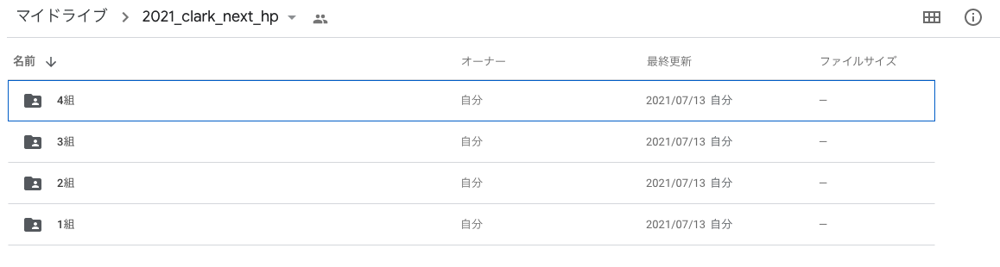

# ホームページ制作課題について

## 課題内容

以下のゲームを作成する

- 占いゲーム
- クイズゲーム
- ジャンケンゲーム

+ 時間がある人はオリジナルゲーム作成

 

## 課題評価

### 評価の観点

#### 技術点
- 配列が使えている
- 乱数が使えている
- DOMの操作でIDから要素を取得できる
- クリックイベントを追加できる
- if文、for文が使える

 

## 提出期限  

 2/9（水） 23:59

## 提出方法  

■提出先URL

[https://drive.google.com/drive/u/0/folders/1S7t3_F88_bo_O1X083zOO795KR_dLYDq](https://drive.google.com/drive/u/0/folders/1S7t3_F88_bo_O1X083zOO795KR_dLYDq)

#### ① 自分のクラスを選択**

### ②前期作成したフォルダを選択（ない場合は作成する）

#### ③ デスクトップのゲームフォルダをgoogle driveにドラッグ＆ドロップする。

**※万が一、操作ミス等で他人のフォルダやクラスのフォルダなどを変更してしまった場合は、先生にDMで連絡してください。**

