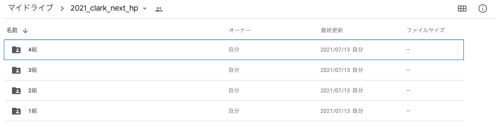
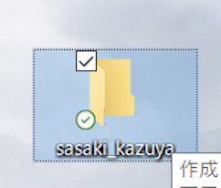
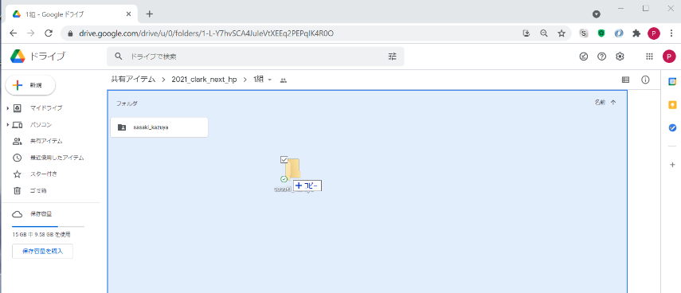
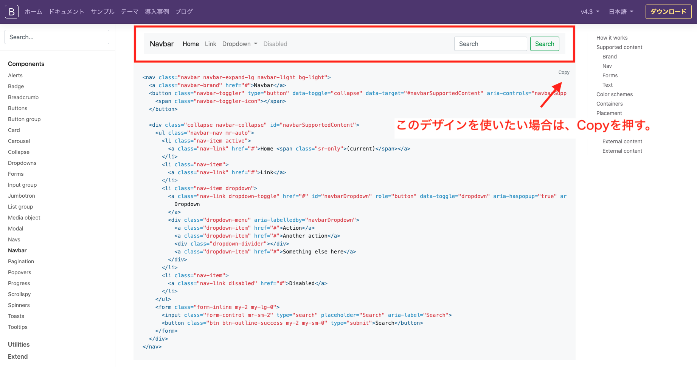
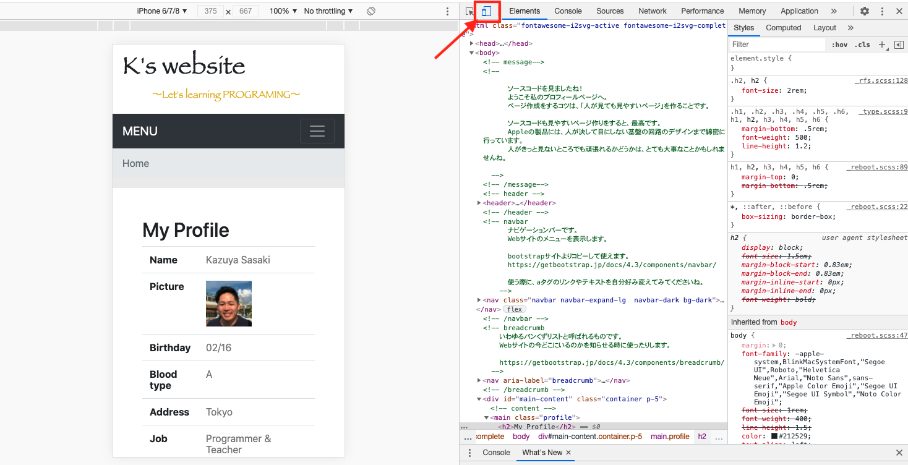

<script>
(() => {
    // 不要なバナー & フッター削除
    let bannerTags = document.getElementById("banner");
    bannerTags.remove();
    setTimeout(() =>{
        let footerTags = document.getElementsByTagName("footer");
        footerTags[0].remove();

        let h2Tag = document.getElementsByClassName("tag-h2");
        if(h2Tag){
            let tags_count = h2Tag.length
            for(let i=0;i<tags_count;i++){
                h2Tag[0].remove();
            }
        }
    }, 300);
    // ヘッダー非表示
    let headers = document.getElementsByTagName("header");
    headers[0].classList.add('d-none');

})();
</script>
<style>
header h1 {
    margin-bottom: 30px;
}
header p {
    margin: 10px;
}
.wrapper h1 {
  border-bottom: solid 3px black;
  font-size: 30px;
  margin-top: 15px;
  margin-bottom: 30px;  
}
.wrapper h2 {
  padding: 0.4em 0.5em;
  font-size: 20px;
  color: #494949;
  background: #f4f4f4;
  border-left: solid 5px #7db4e6;
  border-bottom: solid 3px #d7d7d7;
  margin-top: 10px;
  margin-bottom: 15px;  
}
.wrapper h3 {
  border-bottom: solid 1px black;
  color: #7db4e6;
  margin-top: 5px;
  margin-bottom: 10px;  
}
ol li{
    padding-top: 10px;
    padding-bottom: 10px;
}
.header--unpinned {
    display: none;
}
section {
    margin-top: 30px;
}
section ul {
    list-style-type: disc !important;
    list-style-image: none !important;
}
</style>


# ホームページ制作課題について

## 課題内容

以下のWebページを作る。

- 自身のプロフィールページを作成
- 好きな〇〇を紹介するページを作成


#### サンプルページ

佐々木プロフィールページ: [https://k-sasaking.github.io/clark-js/profile.html](https://k-sasaking.github.io/clark-js/profile.html)

石井プロフィールページ: [https://hiro-107.github.io/hirox/](https://hiro-107.github.io/hirox/)


<br/>

## 課題評価

### 評価の観点

#### 技術点
- 見出しタグが使われている ([参考](https://paiza.jp/works/html/primer/beginner-html1/11000))
- pタグが使われている ([参考](https://paiza.jp/works/html/primer/beginner-html1/11002))
- 画像が表示されている ([参考](https://paiza.jp/works/html/primer/beginner-html3/11020))
- リンクが設置されている ([参考](https://paiza.jp/works/html/primer/beginner-html3/11020))
- リストが使えている ([参考](https://paiza.jp/works/html/primer/beginner-html3/11021))
- テーブルが使えている ([参考](https://paiza.jp/works/html/primer/beginner-html3/11022))
- グリッドシステムが使えている ([参考](https://paiza.jp/works/html/primer/beginner-html3/11025))

#### デザイン点
- レスポンシブなデザインになっている (例：画像、余白など([参考1](https://paiza.jp/works/html/primer/beginner-html2/11014))([参考2](https://paiza.jp/works/html/primer/beginner-html3/11020))
- 色使いが工夫されている ([参考1](https://paiza.jp/works/design/primer/design-1/19001))([参考2](https://paiza.jp/works/design/primer/design-1/19003) )
- 余白が見やすいように調整されている([参考1](https://paiza.jp/works/design/primer/design-1/19001))([参考2](https://paiza.jp/works/design/primer/design-1/19006))


#### その他加点項目
- Navigation barが使えている ([参考](https://paiza.jp/works/html/primer/beginner-html3/11021))
- ページの内容がわかりやすくまとまっている
- ページ数

<br/>

## 提出方法 <span style="color:red;"> New 7/14</span>

**提出方法が変わりました。**

■提出先URL

[https://drive.google.com/drive/u/0/folders/1S7t3_F88_bo_O1X083zOO795KR_dLYDq](https://drive.google.com/drive/u/0/folders/1S7t3_F88_bo_O1X083zOO795KR_dLYDq)


① 自分のクラスを選択



② デスクトップのindex.htmlの入っているフォルダ名を以下ののように変更する。

※フォルダ名のルール：**myoji_namae**となるように書く。（例：**sasaki_kazuya**)

- 半角英数字
- フルネーム
- 記号は**_**を使う

**上記のルールに基づいてないと評価対象にならない場合があるので、守るようにしてください。**




③ デスクトップのフォルダをgoogle driveにドラッグ＆ドロップする。




**※万が一、操作ミス等で他人のフォルダやクラスのフォルダなどを変更してしまった場合は、先生にDMで連絡してください。**

<br/>
<br/>
<br/>

## 課題に取り組む上での注意点

- <b>著作物の利用について</b>を一読すること。
- 全てのページが作成完了したら、「好きな〇〇を紹介するページを作成」を２つ目追加しましょう。
- できた作品は校内のネットワークで見られるようにする予定です。
- また、良い作品は一般公開する場合があります（※一般公開する際は声かけます）。
- コードを見やすく書くことを意識すると、修正しやすくなります。
<br/>


## 課題に取り組むヒント

### 何から取り組めばいいかわからない時どうする？

<p>下記サイトのように、HTMLのみでまずはプロフィールを書いてみましょう。</p>

<a href="https://liginc.co.jp/230184" target="_blank">https://liginc.co.jp/230184</a>

※上記のWebサイトのコードを利用する場合、htmlタグ/headタグ/bodyタグが省略されていますのでご注意ください。（タグの省略について知りたい方は[コチラ](https://agohack.com/html-closetags/)を参照）


プロフィールの項目は、自分で好きに自由に変えて下さい。

<br/>


## Bootstrapの利用について


### Bootstrapのバージョンについて

<p>paizaラーニングの教材では、古いversionのBootstrap（Bootstrap3）を利用しているため、<b class="color:red;">Bootstrap4を利用してください。</b></p>


<p>Bootstrap4の<a href="https://getbootstrap.jp/docs/4.3/getting-started/introduction/#%E3%82%B9%E3%82%BF%E3%83%BC%E3%82%BF%E3%83%BC%E3%83%86%E3%83%B3%E3%83%97%E3%83%AC%E3%83%BC%E3%83%88" target="_blank">スターターテンプレート</a>があるので、以下のコードをコピーして使って下さい。</p>


```
<!doctype html>
<html lang="ja">
  <head>
    <!-- Required meta tags -->
    <meta charset="utf-8">
    <meta name="viewport" content="width=device-width, initial-scale=1, shrink-to-fit=no">

    <!-- Bootstrap CSS -->
    <link rel="stylesheet" href="https://stackpath.bootstrapcdn.com/bootstrap/4.3.1/css/bootstrap.min.css" integrity="sha384-ggOyR0iXCbMQv3Xipma34MD+dH/1fQ784/j6cY/iJTQUOhcWr7x9JvoRxT2MZw1T" crossorigin="anonymous">

    <title>Hello, world!</title>
  </head>
  <body>
    <h1>Hello, world!</h1>

    <!-- Optional JavaScript -->
    <!-- jQuery first, then Popper.js, then Bootstrap JS -->
    <script src="https://code.jquery.com/jquery-3.3.1.slim.min.js" integrity="sha384-q8i/X+965DzO0rT7abK41JStQIAqVgRVzpbzo5smXKp4YfRvH+8abtTE1Pi6jizo" crossorigin="anonymous"></script>
    <script src="https://cdnjs.cloudflare.com/ajax/libs/popper.js/1.14.7/umd/popper.min.js" integrity="sha384-UO2eT0CpHqdSJQ6hJty5KVphtPhzWj9WO1clHTMGa3JDZwrnQq4sF86dIHNDz0W1" crossorigin="anonymous"></script>
    <script src="https://stackpath.bootstrapcdn.com/bootstrap/4.3.1/js/bootstrap.min.js" integrity="sha384-JjSmVgyd0p3pXB1rRibZUAYoIIy6OrQ6VrjIEaFf/nJGzIxFDsf4x0xIM+B07jRM" crossorigin="anonymous"></script>
  </body>
</html>
```

<br>

参考資料 Bootstap4の公式サイト

<a href="https://getbootstrap.jp/docs/4.3/getting-started/introduction/" target="_blank">https://getbootstrap.jp/docs/4.3/getting-started/introduction/</a>


### Navigation Barの利用について

**※paizaのnavigation barが使えないので<span style="color:red;">以下のコードをコピーして使ってください。</span>**


```
<nav class="navbar navbar-expand-lg navbar-light bg-light">
  <a class="navbar-brand" href="#">メニュー</a>
  <button class="navbar-toggler" type="button" data-toggle="collapse" data-target="#navbarNav" aria-controls="navbarNav" aria-expanded="false" aria-label="Toggle navigation">
    <span class="navbar-toggler-icon"></span>
  </button>
  <div class="collapse navbar-collapse" id="navbarNav">
    <ul class="navbar-nav">
      <li class="nav-item active">
        <a class="nav-link" href="#メニュー１のリンク">メニュー１</a>
      </li>
      <li class="nav-item">
        <a class="nav-link" href="#メニュー2のリンク">メニュー2</a>
      </li>
      <li class="nav-item">
        <a class="nav-link" href="#メニュー3のリンク">メニュー3</a>
      </li>
    </ul>
  </div>
</nav>
```

※**「メニュー」「メニュー１」「メニュー２」「メニュー３」「#メニュー１のリンク」「#メニュー2のリンク」「#メニュー3のリンク」**などは 、適宜変えるようにして使ってください。

<br/>
<br/>
<br/>

他のナビゲーションバーを使いたい人は、こちら（<a href="https://getbootstrap.jp/docs/4.3/components/navbar/" target="_blank">Bootstrap Navigation bar サンプル</a>
）からコピーして使ってください。


<p>bootstrapのナビゲーションバーのコピーのやり方</p>



<br/>

### 画像のレスポンシブ化について

**※paizaのimg-responsiveが古くて使えないので以下のコードをコピーして使ってください。**

<p>以下のように、<b style="color:red;">classの中に"img-fluid"</b>を入れてください。</p>

```

```

<br/>
<br/>
<br/>

<p>img-fluid以外にもimg-thumbnailを指定するなどすることもできます。(<a href="https://getbootstrap.jp/docs/4.3/content/images/" target="_blank">参考サイト</a>)</p>

<br/>

### レスポンシブデザインかどうかの確認のやり方

- GoogleChromeで 「右クリック」 > 「検証」　を押す。
- スマホのアイコンをON/OFFすることでスマホ用画面とPC用画面で切り替えることができます



- 上記の切り替えでデザインが崩れていなければOKです。

<br/>
<br/>
<br/>

<hr/>
<hr/>

## 著作物の利用について

<p>Webページを作る際、<b>画像/音声/動画/文章/地図</b>などのデータを利用する場合、勝手に利用/編集した場合、最大で<b>10年以下の懲役又は1000万円以下の罰金</b>に課せられる可能性があります。<br/>
充分注意して正しく引用しましょう。</p>

<hr/>

## 著作権ってどんな権利？

著作物（音楽、絵画、写真、図形、映画、など創作物）における、著作者の権利を保護するために認められた権利の総称です。

コピーライトとも呼ばれる。

主に、２つの権利がある。
- <b>著作者人格権</b>：著作者の了承なしに著作物の編集/著作者の公表などをしてはいけない等。
- <b>著作権(財産権)</b>：複製/展示/2次的著作物の利用の権利は著作者がもっている等。

<hr/>

## 著作物とは？

「**個人の思想や考えが反映されているもの**」は、**全て**著作物に該当する。

<br/>

#### 著作権の対象になるもの
**画像/音楽/文章/記事/地図/作文/キャッチコピー/デザイン/ソースコード**など...

個人の思想や考えが含まれているものは、全て著作物です。

※<u>みなさんの作成した作文なども著作物にあたります。</u>

<br/>

#### 著作権の対象にならないもの
- 客観的事実（ニュースの情報など）
- 著作者が死後70年経った著作物（昔のクラシック音楽など）

<br/>
<br/>

<p>もっと詳しく知りたい人へ</p>

<blockquote class="blockquote">
  <a href="https://jrrc.or.jp/study/" target="_blank">著作権クイズにチャレンジする</a>
  <div class="blockquote-footer">公益社団法人日本複製権センターより <cite>https://jrrc.or.jp/study/</cite></div>
</blockquote>

<br/>

<blockquote class="blockquote">
    <a href="https://takizawalaw.com/1935/" target="_blank">SNSを利用した著作権問題例</a>
    <div class="blockquote-footer">たきざわ法律事務所 <cite>https://takizawalaw.com/1935/</cite></div>
</blockquote>


<hr/>

## 正しい引用方法と画像の使い方

- 原則、<b style="color:red;">著作物の引用方法などが記載されていない場合は使用しない。</b>また、<b>使用したい場合は、該当のWebサイトの利用規約/引用のルールに則って正しく引用する</b>こと。

- 引用していいか判断つかないものについては、過去の裁判の判例などを調べること。調べても判断つかないことについては極力やらない。

- 著作者が不快に思うことは<span style="color:red;">原則禁止</span>。

<hr/>

<blockquote class="blockquote">
    <pre style="background-color: #dcdcdc;color: #3d3dd3d;">
    （注5）引用における注意事項
    他人の著作物を自分の著作物の中に取り込む場合，すなわち引用を行う場合，一般的には，以下の事項に注意しなければなりません。

    （1）他人の著作物を引用する必然性があること。
    （2）かぎ括弧をつけるなど，自分の著作物と引用部分とが区別されていること。
    （3）自分の著作物と引用する著作物との主従関係が明確であること（自分の著作物が主体）。
    （4）出所の明示がなされていること。（第48条）
    （参照：最判昭和55年3月28日 ｢パロディー事件｣）
    </pre>    
    <div class="blockquote-footer">引用元：著作物が自由に使える場合 | 文化庁 
    <cite>
    https://www.bunka.go.jp/seisaku/chosakuken/seidokaisetsu/gaiyo/chosakubutsu_jiyu.html
    </cite>
    </div>
</blockquote>

<br/>

以下のことを気をつけましょう。

- **引用する必然性のあるもの**を使うこと。
- 引用しているかどうかを**視覚的にわかりやすく**する。
- 引用が中心のコンテンツを避ける。（あくまで**補助として使用**）
- 引用元の **「サイト名、記事名、URL」などを明記** する。

<hr/>

## 画像を引用する時の注意点

### フリー素材orオリジナル画像・写真を使う
フリーだからと言って、なんでもかんでも使っていいものではありません。

必ず「<b style="color:red;">利用規約</b>」があるので、確認しましょう。
（実際に、**利用規約を読まずに使われて、裁判になった例もあり**ます。）

利用する場合は、以下の観点を見るようにしましょう。
- <b style="color:red;">商用利用が可能</b>か
- <b style="color:red;">引用元の表記などは必要</b>か
- **画像を加工可能か（記載ない場合は<span style="color:red;">原則禁止</span>）**

<hr/>

### 利用規約によっては無料で使えるWebサイト

使う場合は**ライセンスや利用規約は必ず確認する**こと。

#### アイコン

- [https://icooon-mono.com/](https://icooon-mono.com/)
- [http://pictogram2.com/](http://pictogram2.com/)
- [https://icon-rainbow.com/](https://icon-rainbow.com/)
- [https://kage-design.com/](https://kage-design.com/)

#### 写真

- [https://www.beiz.jp/summary.html](https://www.beiz.jp/summary.html)
- [https://photosku.com/](https://photosku.com/)

<br/>

### ネットで拾った画像は使わない。他者の画像を使いたい場合は許可をとる。

google画像検索やWebサイト上に**アップロードされている画像を無断で使うのは<span style="color:red;">原則禁止</span>**。

使いたい場合は、許可を得ること。（**生徒間でも同様**です）

<br/>

### 直リンク禁止（他社のサーバーに負荷をかけてはいけない）

**直リンク**とは、**aタグのhref属性の値に"https"がついているもの**を使うことです。（直リンクで利用可の場合はOK）

```
src="https://xxxxxxxxxx.png"
```

直リンクは、相手のサーバーに負荷をかけてしまうため、<span style="color:red;">原則禁止</span>です。

基本は、**利用する画像を自分のPC上にダウンロード**して、利用します。

<hr/>

## 文章を引用する方法

wikipediaなどの文章を引用したい場合は、**「引用」であることを視覚的にわかりやすくする**必要があります。<br/>

<a href="https://ja.wikipedia.org/wiki/%E8%91%97%E4%BD%9C%E6%A8%A9" target="_blank">Wikipediaの著作権について</a>を引用する場合の例を書きます。

<br/>

<blockquote class="blockquote">
    <pre style="background-color: #dcdcdc;color: #3d3dd3d;">
    著作権（ちょさくけん、英語: copyright、コピーライト）は、作品を創作した者が有する権利である。また、作品がどう使われるか決めることができる権利である[1]。作者の思想や感情が表現された文芸・学術・美術・音楽などを著作物といい[2]、創作した者を著作者という。知的財産権の一種。
    </pre>    
    <div class="blockquote-footer">
    引用元：（著作権 - Wikipedia）
    <cite>
    https://ja.wikipedia.org/wiki/%E8%91%97%E4%BD%9C%E6%A8%A9
    </cite>
    </div>
</blockquote>

<br/>

### 文章を引用するときのポイント
- **引用元を書く「Webサイト名」「引用元のURL」ブログであれば「記事名」**など。
- 引用であることをわかりやすくするために、**引用部分の背景の色を変えるなど工夫**をする。


### 簡単な引用の見た目を作る方法

一番簡単な方法としては、cssを使う方法があります。
cssで、引用部分の背景を変えるなどして、工夫してみてください。

```
<div style="margin: 0 auto;">
    <p style="background-color: #d8d8d8;color: #3d3d3d; margin: 30 auto;">
    著作権（ちょさくけん、英語: copyright、コピーライト）は、作品を創作した者が有する権利である。また、作品がどう使われるか決めることができる権利である[1]。作者の思想や感情が表現された文芸・学術・美術・音楽などを著作物といい[2]、創作した者を著作者という。知的財産権の一種。（引用文章をここに書く）
    </p>
    <p style="font-size:12px;">引用元：（著作権 - Wikipedia） <u>https://ja.wikipedia.org/wiki/%E8%91%97%E4%BD%9C%E6%A8%A9</u>（引用元の情報を書く）</p>
</div>
```

上記のコードを実行すると以下のような見た目になります。

<br/>
<div style="margin: 0 auto;">
    <p style="background-color: #d8d8d8;color: #3d3d3d; margin: 30 auto;">
    著作権（ちょさくけん、英語: copyright、コピーライト）は、作品を創作した者が有する権利である。また、作品がどう使われるか決めることができる権利である[1]。作者の思想や感情が表現された文芸・学術・美術・音楽などを著作物といい[2]、創作した者を著作者という。知的財産権の一種。（引用文章をここに書く）
    </p>
    <p style="font-size:12px;">引用元：（著作権 - Wikipedia） <u>https://ja.wikipedia.org/wiki/%E8%91%97%E4%BD%9C%E6%A8%A9</u>（引用元の情報を書く）</p>
</div>

<br/>
<br/>
<br/>


引用のやり方について詳しく知りたい方は[こちら](https://techacademy.jp/magazine/5755)を参考にしてみてください。


<script>
(()=>{
    var hd = document.getElementsByTagName('header')
    hd[0].remove();
})();
</script>
<script src="https://code.jquery.com/jquery-3.3.1.slim.min.js" integrity="sha384-q8i/X+965DzO0rT7abK41JStQIAqVgRVzpbzo5smXKp4YfRvH+8abtTE1Pi6jizo" crossorigin="anonymous"></script>
<script src="https://cdnjs.cloudflare.com/ajax/libs/popper.js/1.14.7/umd/popper.min.js" integrity="sha384-UO2eT0CpHqdSJQ6hJty5KVphtPhzWj9WO1clHTMGa3JDZwrnQq4sF86dIHNDz0W1" crossorigin="anonymous"></script>
<script src="https://stackpath.bootstrapcdn.com/bootstrap/4.3.1/js/bootstrap.min.js" integrity="sha384-JjSmVgyd0p3pXB1rRibZUAYoIIy6OrQ6VrjIEaFf/nJGzIxFDsf4x0xIM+B07jRM" crossorigin="anonymous"></script>


