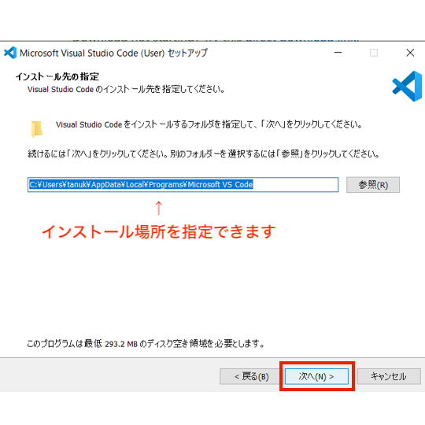

<!--

        ソースコードを見ましたね！
        
        プログラミング学習は、言語学習と同じで使えば使うほど上達します。
        
        どんどん上達するコツは、たくさん「アウトプット」をすることです。

        どんどんコードを書いて、スキルアップをしていきましょう！

-->

<link rel="stylesheet" href="https://stackpath.bootstrapcdn.com/bootstrap/4.4.1/css/bootstrap.min.css" integrity="sha384-Vkoo8x4CGsO3+Hhxv8T/Q5PaXtkKtu6ug5TOeNV6gBiFeWPGFN9MuhOf23Q9Ifjh" crossorigin="anonymous">

# 1. カリキュラムについて

<a class="btn btn-primary" data-toggle="collapse" href="#curriculum" aria-expanded="false" aria-controls="curriculum"> カリキュラム（一年間の流れ） </a>

    

        <iframe src="https://docs.google.com/presentation/d/e/2PACX-1vQHBu3W-Qh2nCDJi9eC-vRLT83q9YhO7CpLByOwyEBahqT3PlFQXErvjlTVAe0oT9_sPmxIqtcBEi7U/embed?start=true&loop=false&delayms=60000" frameborder="0" width="500" height="297" allowfullscreen="true" mozallowfullscreen="true" webkitallowfullscreen="true"></iframe>
    

 

<a id="flow" class="btn btn-primary" data-toggle="collapse" href="#curriculumFlow" aria-expanded="true" aria-controls="curriculumFlow"> 学習の流れ詳細 </a>

    

        
HTML/CSS入門編 （<a href="#paizaRange">Paizaの学習範囲</a>） （全てのチャプター）

        
↓

        
Webデザイン入門（<a href="#paizaRange">Paizaの学習範囲</a>）New 5/17 
        範囲（Lesson1:全て  Lesson2:01〜06  Lesson3: 01,02）
        

        
↓

        
<a href="homepage.html" target="_blank">自己紹介HP製作</a>  New 5/24

        
↓

        
JavaScript体験編 （<a href="#paizaRange">Paizaの学習範囲</a>） （全てのチャプター）

        
↓

        
JavaScript入門編 （<a href="#paizaRange">Paizaの学習範囲</a>） （全てのチャプター）

        
↓

        
JavaScript 基礎（佐々木/石井の教材）関数＋DOM操作

        
↓

        
JavaScript 実践（佐々木/石井の教材）

        
↓

        
個人/グループ製作（HTML＆CSS＆JavaScript）

    

# 2. Slackについて

<a class="btn btn-primary" data-toggle="collapse" href="#slackRegister" aria-expanded="false" aria-controls="slackRegister"> slackへの登録のやり方 </a>

    

        <ol>
            <li> <a href="https://slack.com/intl/ja-jp/downloads/windows" target="_blank">Slack Download for Windows</a>からslackアプリケーションをダウンロードし、インストールをする（<a href="https://slack.com/intl/ja-jp/help/articles/207691318-%E3%83%A2%E3%83%90%E3%82%A4%E3%83%AB%E7%89%88-Slack-%E3%82%92%E3%83%80%E3%82%A6%E3%83%B3%E3%83%AD%E3%83%BC%E3%83%89%E3%81%99%E3%82%8B" target="_blank">スマホアプリ</a>もあります）</li>
             
            <li> 
招待状のメール or <a href="https://join.slack.com/t/clark-programing/shared_invite/zt-pkyw2cmc-4GFSjpdGeAsmGxC5RTQR3w" target="_blank">こちらのリンク</a>から clark-programingの招待ページへアクセス

             
            
※招待メールが送られてきてない場合は、石井先生or佐々木先生に伝えてください。

             
            
招待メールの場合は、<b>JoinNow</b>をクリック

            
            </li>
            <li>
            アカウントを作成する。 
            アカウント作成時に、<b>名前とパスワード</b>が聞かれますので入力してください。 
            
             
            
もし、以下のような画面が出てきたら、<b>メールアドレス</b>を入力してください。

            
            </li>
        </ol>
    

 

<a class="btn btn-primary" data-toggle="collapse" href="#slackTodo" aria-expanded="false" aria-controls="slackTodo"> slackの登録済みの人がやること４つ </a> New 5/17

    

        <h2>①Slackの通知の設定</h2>
        <ol>
            <li>アプリ左上の「<b>clark-programing▼</b>」を押す</li>
            <li>「<b>環境設定（Preferences)</b>」を押す</li>
            <li>
            「<b>ダイレクトメッセージ&メンション&キーワード</b>」を選択する 
            
            </li>
        </ol>
         
         
        <h2>②チャンネルに参加</h2>
        <ol>
            <li>「<b>チャンネル +</b>」を押す</li>
            <li>「<b>チャンネル一覧（Browse）</b>」を押す 
            
            </li>
            <li>
            以下のチャンネルの「<b>参加する</b>」を押す 
                <ul>
                    <li><b>連絡</b></li>
                    <li><b>1-x_202X年度</b></li>
                </ul>
            
            </li>
        </ol>
         
         
        <h2>③名前の変更</h2>
        
slackの表示名が自分の名前の人は大丈夫です。

        <ol>
            <li>アプリ右上の<b>ユーザーアイコン</b>を押す</li>
            <li>「<b>プロフィールの編集(Edit Profile)</b>」を押す</li>
            <li>氏名/表示名を編集する</li>
        </ol>
         
        <h2>④自己紹介（宿題）</h2>
        
 自己紹介チャンネルに自己紹介を記載する

        
※他の授業中に送ると他の生徒に通知が入ってしまうので、<b>授業時間を避けて投稿</b>してください。

    

 

<a class="btn btn-primary" data-toggle="collapse" href="#slackRule" aria-expanded="true" aria-controls="slackRule"> slackの使い方とルール </a>（<b>※必読</b>）New 5/17

    

        <b>生徒間のDMは原則禁止です。</b> <i>※slackの登録しているメールアドレスも原則禁止。</i> 
         
        <b>SNS同様、slackの使い方にも情報モラルを持って</b>使ってください。 
        slack内でのコミュニケーションにおいて、<b>校則に反した場合は、生徒指導の対象になります</b>ので、充分注意して使ってください。 
    

 

<a class="btn btn-primary" data-toggle="collapse" href="#howToQuestion" aria-expanded="true" aria-controls="howToQuestion"> 質問のやり方 </a> New 5/17

    

        <h2>わからないことがあった時の手順</h2>
        <ol>
            <li>まずは<b>自分で10分以上調べる</b>。</li>
            <li> <b>各クラスのチャンネル（＃1-x_2021年度）でクラスのみんなに質問</b>  
            <b>先生にslackでDM</b>で質問する/<b>直接手を上げて質問</b>する。</li>
        </ol>
        <h2>クラスチャンネルでの質問について</h2>
        
<b>クラスのチャンネルでの質問は生徒間で教え合うこと</b>がメインです。

        
クラスチャンネルで質問が投稿されていたら、答えられる人がいたら教えてあげてください。

        
時間が経っても解決されない場合は、先生から回答することがあります。

         
        <h2>先生に質問する際の注意点</h2>
        
slackでの質問の回答については原則授業中の時間で回答します

        
解決するのにどの方法を取るべきかは、自分で判断をしてください。 
        （先生が他の質問対応している場合、返信するのに時間がかかる場合があります。）

    

# 3.Paizaラーニングについて

<a class="btn btn-primary" data-toggle="collapse" href="#howToLearning" aria-expanded="true" aria-controls="howToLearning"> 学習のやり方 </a>

    

        <ol>
            <li><a href="https://paiza.jp/works/courses" target="_blank">paizaラーニング</a>にログインし、学習する<b>コース</b>を選択します。</li>
            <li><b>レッスン</b>を選択 -> <b>チャプター</b>を選択します。</li>
            <li>演習課題がある課題については、<b>演習課題を必ずやる</b>ようにしてください。 
                 
                
演習問題が複数ある場合もあるので注意

                 
            </li>
            <li>
                <全ての演習課題がsuccessになったらチャプター完了です。 以下の画面のように、<b>全ての演習課題をクリア</b>かつ<b>受講済</b>にしてください。 
                                 
            </li>
        </ol>
        
※<b>イヤホンを必ず持参してください。</b>イヤホンは学校側で予備がありません。 

    

 

<a class="btn btn-primary" id="paizaRange" data-toggle="collapse" href="#paizaList" aria-expanded="true" aria-controls="paizaList"> paizaの学習範囲 </a> New 5/17

    

    <table>
        <tr>
            <th>#</th>
            <th>講座</th>
            <th>範囲</th>
        </tr>
        <tr>
            <td>1</td>
            <td><a href="https://paiza.jp/works/html/primer" target="_blank">HTML/CSS入門</a></td>
            <td>全てのレッスン</td>
        </tr>
        <tr>
            <td>2</td>
            <td><a href="https://paiza.jp/works/html/primer" target="_blank">Webデザイン入門</a></td>
            <td>
            <ul>
                <li>Lesson1: 全てのチャプター</li>
                <li>Lesson2: 01〜06まで</li>
                <li>Lesson3: 01,02のみ</li>
            </ul>
            </td>
        </tr>
        <tr>
            <td>3</td>
            <td><a href="https://paiza.jp/works/javascript/trial" target="_blank">Javascript体験</a></td>
            <td>全てのレッスン</td>
        </tr>
        <tr>
            <td>4</td>
            <td><a href="https://paiza.jp/works/js/primer" target="_blank">Javascript入門</a></td>
            <td>全てのレッスン</td>
        </tr>
    </table>
    
学習の順番は、<a href="#flow">カリキュラムの「学習の流れ詳細」</a>を参照してください。

    

# 4. Visual Studio Codeのインストール

<a class="btn btn-primary" data-toggle="collapse" href="#whatIsVSCode" aria-expanded="true" aria-controls="whatIsVSCode"> Visual Studio Codeとは </a>  New 5/24

    

        
エディターと言って、<b>ソースコードを作成/編集するためのソフト</b>の一つです。

        
他にもメモ帳, サクラエディタ, Atom, Notepad++, Vimなど、さまざまなエディターがあります。

        
今回は、Microsoft社が開発しているエディターで、性能も良く一般的に使われているVisual Studio Code(略:VS Code)をインストールして使用します。

        
 コーディングサポート機能や拡張性にも優れていて、 マルチプラットフォームにも対応しています。

    

 

<a class="btn btn-primary" data-toggle="collapse" href="#installVSCode" aria-expanded="true" aria-controls="installVSCode"> Visual Studioのインストール方法 
</a> New 5/24

    

        <h2>Visual Studio Codeのインストール</h2>
        
1. 下記のサイトからダウンロード

        
<a href="https://code.visualstudio.com/download" target="_blank">https://code.visualstudio.com/download</a>

        
         
        
2. ダウンロードしたファイル(VSCodeUserSetup-x64-X.XX.Xexe)を開く ※Xの部分はバージョンの数字が入ります。

         
        
3. 「次へ」を押す

        
        
        
        
         
        
4. インストール完了

        
    

 

<a class="btn btn-primary" data-toggle="collapse" href="#howToMakeHtmlVSC" aria-expanded="true" aria-controls="howToMakeHtmlVSC"> Visual Studio CodeでHTMLファイルを作成する方法
 </a>  New 5/24

    

        <h2>Visual Studio CodeでHTMLファイルを作成する方法</h2>
        
1. デスクトップにフォルダを作成 ※自分で管理できる人はデスクトップじゃなくてもOK

        
         
        
2. 「右クリック → 新規フォルダ →　名前をつける」 ※フォルダ名はなんでもよし迷ったときは「プログラミング基礎」にする

         
        
3. フォルダを開き、新規でファイルを作成する

        
フィイルの拡張子を表示する。（表示タブ > ファイル名拡張子に✔️）

        
         
        
ファイル作成時、名前をindex.htmlにする。

        
         
        
※ファイル名変更のやり方（ファイルの上で右クリック > 「名前の変更」）

        
         
        
拡張子を変更するアラートが出たら、「はい」を押す。

        
         
        
4. Visual Studio Codeを開く

        
「フォルダから開く」を押して、作成したフォルダを選択

        
        
index.htmlが表示されていればOK

        
         
        
5. VS Codeでindex.htmlを以下のように編集する

        <pre>
        <code style="color:white;">
&lt;html lang=&quot;ja&quot;&gt;
  &lt;head&gt;
    &lt;!-- Required meta tags --&gt;
    &lt;meta charset=&quot;utf-8&quot;&gt;
    &lt;meta name=&quot;viewport&quot; content=&quot;width=device-width, initial-scale=1, shrink-to-fit=no&quot;&gt;
    &lt;!-- Bootstrap CSS --&gt;
    &lt;link rel=&quot;stylesheet&quot; href=&quot;https://stackpath.bootstrapcdn.com/bootstrap/4.3.1/css/bootstrap.min.css&quot; integrity=&quot;sha384-ggOyR0iXCbMQv3Xipma34MD+dH/1fQ784/j6cY/iJTQUOhcWr7x9JvoRxT2MZw1T&quot; crossorigin=&quot;anonymous&quot;&gt;
    &lt;title&gt;Hello, world!&lt;/title&gt;
  &lt;/head&gt;
  &lt;body class=&quot;text-center&quot;&gt;
    &lt;h1&gt;テストページです。&lt;/h1&gt;
    &lt;p&gt;Google chromeで確認できましたか？&lt;/p&gt;
    &lt;img src=&quot;lion.jpg&quot; height=&quot;500&quot;/&gt;
    &lt;!-- Optional JavaScript --&gt;
    &lt;!-- jQuery first, then Popper.js, then Bootstrap JS --&gt;
    &lt;script src=&quot;https://code.jquery.com/jquery-3.3.1.slim.min.js&quot; integrity=&quot;sha384-q8i/X+965DzO0rT7abK41JStQIAqVgRVzpbzo5smXKp4YfRvH+8abtTE1Pi6jizo&quot; crossorigin=&quot;anonymous&quot;&gt;&lt;/script&gt;
    &lt;script src=&quot;https://cdnjs.cloudflare.com/ajax/libs/popper.js/1.14.7/umd/popper.min.js&quot; integrity=&quot;sha384-UO2eT0CpHqdSJQ6hJty5KVphtPhzWj9WO1clHTMGa3JDZwrnQq4sF86dIHNDz0W1&quot; crossorigin=&quot;anonymous&quot;&gt;&lt;/script&gt;
    &lt;script src=&quot;https://stackpath.bootstrapcdn.com/bootstrap/4.3.1/js/bootstrap.min.js&quot; integrity=&quot;sha384-JjSmVgyd0p3pXB1rRibZUAYoIIy6OrQ6VrjIEaFf/nJGzIxFDsf4x0xIM+B07jRM&quot; crossorigin=&quot;anonymous&quot;&gt;&lt;/script&gt;
  &lt;/body&gt;
&lt;/html&gt;
        </code>
        </pre>
        
編集できたら 「ctrl」+「s」を押して保存する。

         
        
6. 画像をダウンロードして、作成したフォルダ内に保存をしてください。<a href="img/lion.jpg" download class="btn btn-success">画像ダウンロード</a>

        
ダウンロードしたファイルを作成したフォルダの中にドラッグ＆ドロップする

        
         
        
以下の画像のようにフォルダ内に、index.htmlとlion.pngがあればOKです。

        
         
        
7. Google Chromeを開く

        
Google Chromeへ「index.html」をドラッグ＆ドロップする

        
    

# 5.オリジナル教材

<a data-toggle="collapse" href="#original" aria-expanded="true" aria-controls="original"> エクストリーム授業 </a> New 7/8

    

      <ul>
        <li><a href="https://k-sasaking.github.io/clark-programing-manual/practice/p1.html">エクストリームHTML講座</a></li>
        <li><a href="https://k-sasaking.github.io/clark-programing-manual/practice/p2.html">エクストリームCSS講座</a></li>
        <li><a href="https://k-sasaking.github.io/clark-programing-manual/practice/p3.html">エクストリームBootstrap講座1</a></li>
        <li><a href="https://k-sasaking.github.io/clark-programing-manual/practice/p4.html">エクストリームBootstrap講座2</a></li>
        <li><a href="https://k-sasaking.github.io/clark-programing-manual/practice/p5.html">ホームページの作り方講座</a></li>
      </ul>
    

# 6.よくあるQ&A

<a data-toggle="collapse" href="#qa1" aria-expanded="false" aria-controls="qa1"> Q1)paizaのログインパスワードを忘れました </a>

    

        <ol>
            <li><a href="https://paiza.jp/password_resets" target="_blank">paizaのログインページへアクセス</a></li>
            <li>「パスワードを忘れた方はこちら」を押す</li>
            <li>「登録済みのメールアドレスを入力」し、「再設定メール送付」をする</li>
            <li>メールにログインをし、URLからパスワードを再設定する</li>
        </ol>
        
※上記の方法でダメな場合は、石井先生に相談してください。

    

<a data-toggle="collapse" href="#qa2" aria-expanded="false" aria-controls="qa2"> Q2)paizaに登録したメールにログインできません。 </a>

    

        <ol>
            <li>石井先生に相談してください。</li>
        </ol>
    

<a data-toggle="collapse" href="#qa3" aria-expanded="false" aria-controls="qa3"> Q3)slackの招待メールが来ません。 </a>

    

        <ol>
            <li>
            石井先生か佐々木先生に相談してください。 
            もしくは、<a href="https://join.slack.com/t/clark-programing/shared_invite/zt-pkyw2cmc-4GFSjpdGeAsmGxC5RTQR3w" target="_blank">こちらのリンク</a>から招待メールなしで参加できます。
            </li>
        </ol>
    

<a data-toggle="collapse" href="#qa4" aria-expanded="false" aria-controls="qa4"> Q4)授業を休んだ時、どうすれば良いですか？ </a>

    

        
こちらのWebサイト、slackのクラスチャンネル、連絡チャンネルより、どんなことをしたか<b>自身でキャッチアップ</b>をしてください。

        
また、paizaの個別学習については、休んだ時間分取り組めると、極端に遅れることはないので、取り組んでみてください。

    

<a data-toggle="collapse" href="#qa5" aria-expanded="false" aria-controls="qa5"> Q5)タイピングが苦手です。何か良い方法はありますか？また、どのくらいのタイピング能力があると良いですか？ </a>

    

        

        <a href="https://www.pken.com/tool/typing.html">P検タイピング</a>がおすすめです。

        

        こちらのサイトの「<b>日本語入力</b>」のゲームを<b>5分</b>設定で実施すると、P検○級レベルと出ます。 
        <b>3級レベルあると良い</b>かもです。<b>準2級レベルあれば十分</b>だと思います。
        

        

        タイピングは量をこなせば誰でも結果が出てくるので、基本ポジションを覚えて頑張りましょう！
        

    

<a data-toggle="collapse" href="#qa6" aria-expanded="false" aria-controls="qa6"> Q6)slackが英語なのですが、日本語設定の方法は？ </a>

    

        <ol>
            <li>アプリ左上の「<b>clark-programing▼</b>」を押す</li>
            <li>「<b>Preferences</b>」を押す</li>
            <li>「<b>Language & reagion</b>」を選択する
            </li>
            <li>「<b>Language</b>」の選択を「<b>日本語</b>」にする</li>
        </ol>
    

<a data-toggle="collapse" href="#qa7" aria-expanded="false" aria-controls="qa7"> Q7)Visual Studio Codeの日本語設定の方法は？ </a> New 6/1

    

    
日本語化したい人は、以下のURLに詳しい手順が載っているので、参考にしてください。

    

        <a href="https://www.javadrive.jp/vscode/install/index4.html" target="_blank">https://www.javadrive.jp/vscode/install/index4.html</a>
    

    

