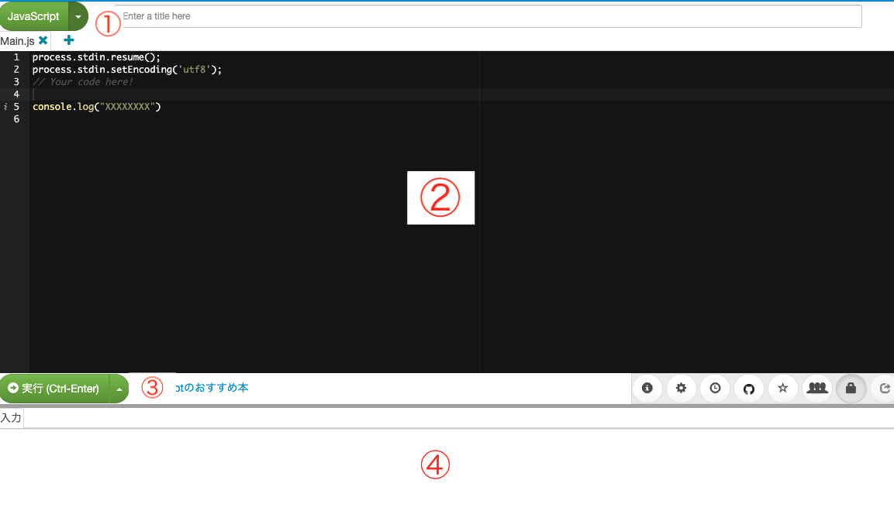

<script>
(() => {
    // 不要なバナー & フッター削除
    let bannerTags = document.getElementById("banner");
    bannerTags.remove();
    setTimeout(() =>{
        let footerTags = document.getElementsByTagName("footer");
        footerTags[0].remove();

        let h2Tag = document.getElementsByClassName("tag-h2");
        if(h2Tag){
            let tags_count = h2Tag.length
            for(let i=0;i<tags_count;i++){
                h2Tag[0].remove();
            }
        }
    }, 300);
    // ヘッダー非表示
    let headers = document.getElementsByTagName("header");
    headers[0].classList.add('d-none');

})();
</script>
<style>
.enshu {
    color: white;
    background-color: blue;
    border: 1px solid;
    padding: 10px 30px;
    display: inline-block;
    margin-bottom: 20px;
}
</style>

# Day3: プロから学ぶjavascriptで占いゲーム

本講義での最終成果物

<a href="janken.html" target="_blank">ジャンケンゲーム</a>

<br/>


## 使うWebサイト

本日は、<a href="https://paiza.io/ja/projects/new" target="_blank">paiza IO</a>を使って実際のコードを書きます。

<br/>

## 使い方



① 言語を選択

② コードを入力

③ コードを実行する

④ 結果を確認

**※今回は、JavaScriptの言語を使うので「JavaScript」を選択してください。**

<br/>
<hr/>
<br/>

## 1章：条件分岐

**条件分岐**とは、例えば**スイッチがONの時とOFFの時**で違う処理をするときに使います。

<br/>

条件分岐は、**if文**を使います。

### if文の使い方
以下のプログラムを実行してみましょう。

```
var age = 10

console.log("年齢を確認します。")

if(age == 10){
   console.log("あなたは10才です。")
}
```

続いて、ageの値を20に変えて実行してみましょう。

<br/>
<br/>


以下のようにif文を使うことである特定の条件を満たした時のみ処理をすることができます。

```
if (/* 条件式 */) {

 /* 処理 */
}
```


### 条件式
**条件式**は、その**条件が○か×かを判断する式**です。

○の時を**true**,×の時を**false**といいます。


|演算子|意味|
|:--:|:--|
|a==b|aとbの値が同じの時true|
|a<b|aがbより小さい時true|
|a>b|aがbより大きい時true|
|a<=b|aがb以下の時true|
|a>=b|aがbより以上の時true|
|a!=b|aとbが異なる値の時true|


### if-else文
if文は条件式がtrueの時に処理をしました。

条件式がfalseの時に処理をする場合は、else文を使います。

以下のプログラムを実行してみましょう。

```
var age = 30
var message = ""

if(age< 20){
    message = "あなたは子供です"
}
else {
    message = "あなたは子供です"
}

console.log(message)
```

ageの値を10にして実行してみましょう。

このように、ifの条件以外の場合、処理を行います。

```
if (/* 条件式 */) {
 /* trueの時の処理 */
}
else {
 /* falseの時の処理 */
}
```


### ３つ以上の分岐
例えば、上記のプログラムを以下のようにしたい場合、


- ageが20未満の時は、子供
- ageが20の時は、成人
- それ以外の時は、大人

と表示する。


以下のように書くことができます。

```
var age = 20

var message = ""

if(age< 20){
   message = "あなたは子供です"
}
else if(age == 20){
   message = "あなたは成人です"
}
else {
   message = "あなたは大人です"
}

console.log(message)
```

ageの値を変えて実行してみよう。

このようにelse ifを使えば、３つ以上の分岐処理もすることができます。

```
if (/* 条件式A */) {

 /* 条件式Aがtrueの時の処理 */
}
else if (/* 条件式B */) {

 /* 条件式Bがtrueの時の処理 */
}
else if (/* 条件式C */) {

 /* 条件式Cがtrueの時の処理 */
}
else {
 /* 条件に当てはまらなかった時の処理 */
}
```


### 複数の条件式の組み合わせ
条件式は組み合わせて使うことができます。


<table>
<tr><th>演算子</th><th>意味</th></tr>
<tr><td>条件式A && 条件式B</td><td>条件式Aと条件式Bが両方trueの時、true</td></tr>
<tr><td>条件式A || 条件式B</td><td>条件式Aか条件式Bのどちらかがtrueの時、true</td></tr>
<tr><td>!(条件式A)</td><td>条件式Aを満たさない時、true</td></tr>
</table>

以下のプログラムを実行しましょう。

```
var age = 21

var message = ""

if(age < 10 || age >= 30){
    message = "あなたは10代もしくは30才以上です"
}
else if(age >=20 && age < 30){
   message = "あなたは20代です"
}

console.log(message)

if (!(age == 20)){
   console.log("あなたは20才ではありません")
}

```

ageの値を変えてプログラムを動かしてみよう。


<div class="enshu">
 演習問題1
</div>

<span style="color:blue;">①以下のプログラムを作成しなさい。</span>

- dayが0の時、"平日"
- dayが1の時、"休日"
- それ以外、"不明"

```
var day =  1
var message = ""

if(){

}else if(){

}else{

}

console.log(message)
```


<span style="color:blue;">② 以下のプログラムを作成しなさい。</span>

xが偶数の場合、「偶数」です。

xが奇数の場合、「奇数」です。


```
var x =  6
var message = ""

if(){

}else{

}

console.log(message)
```


<span style="color:blue;">③ 以下のプログラムを作成しなさい。<span>

(a)xが0未満かつyが0未満の場合、"掛け算をしたら正になります。"と表示する

(b)xかyどちらか0未満の場合は、掛け算をしたら負になります。"と表示する

(c)それ以外の時は、"掛け算をしたら正になります。"と表示する

```
var x = 10
var y = -10

var message = ""

if(){

}else if(){

}else {

}

console.log(message)
```

<br/>
<hr/>
<br/>

## ジャンケンゲームを作ろう！

<div class="enshu">
 課題
</div>

<span style="color:blue;">① ジャンケンの手を配列で定義し、表示しなさい。</span>

- **ヒント１**:　ジャンケンの手（グー、チョキ、パー）を配列で定義しよう。（変数名はhandsを使用してください。）
- **ヒント２**:　console.logでヒント１を表示

```
var hands = []
console.log()
```

<span style="color:blue;">② 自分の手が0の時が「グー」。1の時「チョキ」。2の時「パー」と出力しよう。</span>

- **ヒント１**:　自分の手（my_hand）を定義する。（例: var my_hand = 0 )
- **ヒント２**:　hands配列を使って、自分の手を表示してみよう。

```
var hands = []
var my_hand = 0

console.log()
```

<span style="color:blue;">③ 相手の手をランダムで決めて表示しなさい。</span>

- **ヒント１**:　相手の手（cp_hand）を乱数を使って定義する。
- **ヒント２**:　hands配列を使って、相手の手を表示してみよう。

```
var hands = []
var my_hand = 0
// 乱数を作ってcp_handに代入
var cp_hand = //乱数

console.log()
```


<span style="color:blue;">④ ジャンケンの勝敗を決めよう。</span>

- **ヒント１**:　自分の手（my_hand）と相手の手（cp_hand）を比較して、「勝ち、負け、あいこ」を判定（if文）
- **ヒント２**:　「勝ち、負け、あいこ」に合わせてメッセージを表示しましょう。

```
var hands = []
var my_hand = 0

// 乱数を作ってcp_handに代入
var cp_hand = //乱数

var message = ""

if(){

}else if(){

}else{

}

console.log(message)
```

<span style="color:blue;">④ HTMLファイルに組み込んでみましょう。</span>

- **やり方1**：HTMLファイルをダウンロードしよう。<a href="janken-tmp.html" download="" class="btn btn-success">HTMLファイルダウンロード</a>
- **やり方2**：画像をダウンロードしよう。<a href="janken.jpeg" download="" class="btn btn-success">画像ダウンロード</a>
- **やり方3**：「uranai-tmp.htmlの上で右クリック」=> プログラムから開く => メモ帳
- **やり方4**：

ファイルを開いたら、40行目あたりの以下のソースコードを変更して、アプリを完成させましょう。


```
/** >>>>>ここから編集  **/

// ジャンケンの手を配列で定義
var hands = []

// 乱数を作ってcp_handに代入
var cp_hand = 0
// 勝ち負けの判定
var message = ""
if(){

}else if(){

}else{
    
}

/** ここまで編集<<<<<<<< **/
```

<script>
(()=>{
    var hd = document.getElementsByTagName('header')
    hd[0].remove();
})();
</script>
<script src="https://code.jquery.com/jquery-3.3.1.slim.min.js" integrity="sha384-q8i/X+965DzO0rT7abK41JStQIAqVgRVzpbzo5smXKp4YfRvH+8abtTE1Pi6jizo" crossorigin="anonymous"></script>
<script src="https://cdnjs.cloudflare.com/ajax/libs/popper.js/1.14.7/umd/popper.min.js" integrity="sha384-UO2eT0CpHqdSJQ6hJty5KVphtPhzWj9WO1clHTMGa3JDZwrnQq4sF86dIHNDz0W1" crossorigin="anonymous"></script>
<script src="https://stackpath.bootstrapcdn.com/bootstrap/4.3.1/js/bootstrap.min.js" integrity="sha384-JjSmVgyd0p3pXB1rRibZUAYoIIy6OrQ6VrjIEaFf/nJGzIxFDsf4x0xIM+B07jRM" crossorigin="anonymous"></script>

