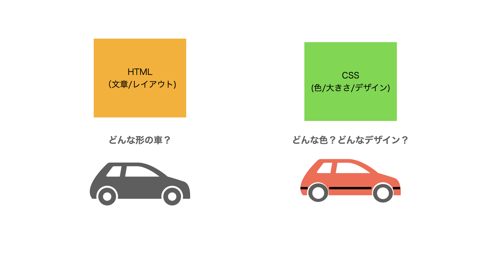
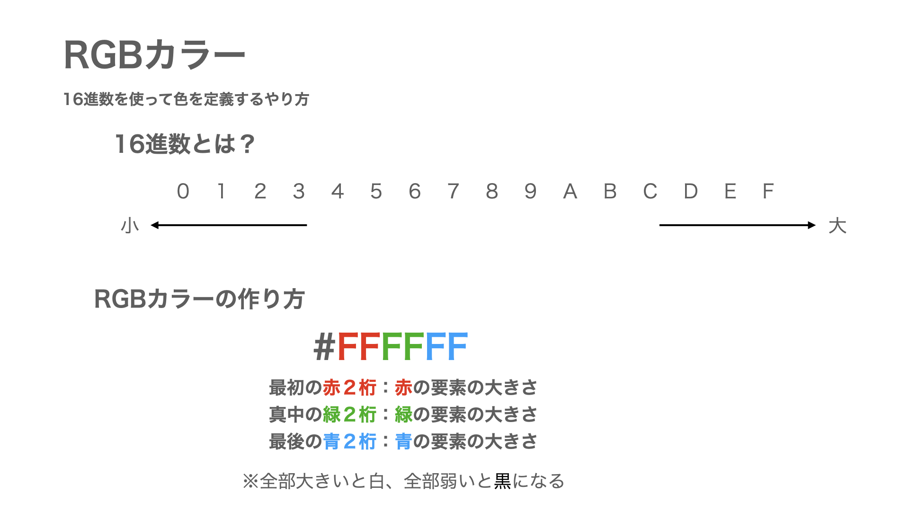

<script>
(() => {
    // 不要なバナー & フッター削除
    let bannerTags = document.getElementById("banner");
    bannerTags.remove();
    setTimeout(() =>{
        let footerTags = document.getElementsByTagName("footer");
        footerTags[0].remove();

        let h2Tag = document.getElementsByClassName("tag-h2");
        if(h2Tag){
            let tags_count = h2Tag.length
            for(let i=0;i<tags_count;i++){
                h2Tag[0].remove();
            }
        }
    }, 300);
    // ヘッダー非表示
    let headers = document.getElementsByTagName("header");
    headers[0].classList.add('d-none');

})();
</script>


# エクストリームCSS講座

<br/>

## CSSって何？

**CSS**とは、<i>Cascading Style Sheets</i>の略

<br/>

**HTMLとCSSの役割**は、以下のようになっています。





<br/>

**HTML**が、h1タグやpタグ、imgタグなどの**パーツを書く**のに対し、<br/>
**CSS**は、文字色、背景の色、枠線などの**デザイン**を書きます。

<br/>

## CSSの書き方

CSSを書く方法は、３つあります。

- **styleタグで囲む**
- タグの属性にstyle属性を定義する
- cssファイルを作りHTMLファイルで読み込む

今回は、paizaで学んだ、**styleタグ**で囲んだ使い方で実践します。

<br/>

### styleタグの使い方

<br/>

CSSを書きたい場合は、HTMLファイルの中で、以下の**styleタグ**を記載します。

```
<style>

ここにCSSを書く

</style>
```

<br/>

例えば、**h1タグの文字を赤色**にしたい場合は、以下のように書くことができます。

```
<style>

h1 {
    background-color: red;
}

</style>
```

<br/>

<a href="https://paiza.jp/works/html/primer/beginner-html1/11001" target="_blank">paiza ラーニングの講義の右側のページ</a>を使って以下のコードをコピーして「コードの実行」してみよう。


```
<h1>背景の色が変わるかな？</h1>

<style>

h1 {
    background-color: red;
}

</style>

```


<br/>

CSSは以下のように書きます。

```
タグの名前 {

    何を変えるか: どのように変えるか;

}
```

今回は、**h1タグ**の**background-color（背景の色）**を**red（赤）**に変えることをしました。

- **タグの名前**: h1
- **何を変えるか**: background-color
- **どのように変えるか**: red

「**タグ**」の「**何**」を「**どのように**」変えるかを書くと覚えると良いです。

<br/>

## CSSの種類

上記の例では、背景の色を変えました。

cssでは他にも、**文字の色、文字の大きさ、枠線**など様々なデザインを入れることができます。

<br/>

例えば、以下のコードを実行してみましょう。


```
<h1>文字の色も変わったよ</h1>

<style>

h1 {
    background-color: red;
    color: white;
}

</style>

```

上記のコードを実行すると、今度は、**h1タグ**の**color（文字の色）**を**white(白)**に変わりました。

<br/>

背景の色、文字の色以外にも**いろいろなことができる**ので、確認してみましょう。


```
<h1>いろいろなデザインを変えたよ</h1>

<style>

h1 {
    background-color: red;
    color: white;
    font-size: 12px;
    margin: 30px;
    padding: 10px;
    border: 3px solid blue;
}

</style>

```

- **font-size** :  フォントの大きさを変える。サイズの単位はpx(ピクセル)
- **margin** :  外側に空白を作る。単位はpx(ピクセル)
- **padding** :  内側に空白を作る。単位はpx(ピクセル)
- **border** :  「太さ 種類 色」を設定できる。

他にも知りたいかは、<a href="http://www.htmq.com/style/" target="_blank">こちらのWebサイト</a>を参考にすると、面白いです。

<br/>
<br/>

## カラーコード

CSSで色を指定するとき、色を**RGBカラー**というもので、表現することがあります。



このルールで色を作ると例えば以下のように色を作ることができます。

- 赤: **#FF0000**
- 青: **#0000FF**
- 緑: **#00FF00**
- 黄: **#FFFF00**
- 紫: **#FF00FF**
- 水: **#00FFFF**
- 白: **#FFFFFF**
- 黒: **#000000**
- 灰: **#999999**

※0からFの値を変えるともっと細かく色を変えることができます。

<a href="https://www.peko-step.com/tool/tfcolor.html" target="_blank">カラーコードで遊ぼう</a>で、どんな色ができるか確認できます。

<br/>

## いろいろなタグのデザインを変える

上記の例では、h1タグを変えました。

いろいろなタグごとにスタイルを変えたい場合は、以下のようにします。

```
<h1>h1タグです。</h1>
<h2>h2タグです。</h2>
<h3>h3タグです。</h3>
<h4>h4タグです。</h4>

<p>pタグです。</p>
<a>aタグです。</a>

<style>
h1 {
    background-color: #ff9900;
}
h2 {
    background-color: #9900ff;
}
h3 {
    background-color: #00ff99;
}
h4 {
    color: #FF9999;
}
p {
    color: #33AACC;
}
a {
    color: #CCCCCC;
}
</style>
```

このようにタグごとにcssを設定することができます。

<br/>
<br/>

## もっとCSSについて知りたい人へ

### cssをタグの中に埋める方法

タグの中にstyle属性でcssを直接書くことができます。

```
<p style="background-color:#FF0000;">pタグpタグpタグpタグpタグ</p>
```

### idやclassでcssを指定する方法

```
<p id="aaa" class="bbb">pタグpタグpタグpタグpタグ</p>
<style>
#aaa {
    background-color: #ff9900;
}
.bbb {
    color: #FFFFFF;
}
</style>
```

タグの中にid属性やclass属性が書いてある場合、cssで指定をすることができます。

idの場合は、#をつける。classの場合は、.をつけることで指定することができます。

### 余白について

余白を作るのにpaddingとmarginを設定することができます。

- padding: **枠の内側に余白を作る**
- margin: **枠の外側に余白を作る**

違いは、以下のコードを実行するとわかります。

```
<div>
<h2>paddingです。</h2>
<h1>marginです。</h1>
<p>グレーがmarginで、青がpaddingのスペースです。</p>
</div>
<style>
div {
    background-color: gray;    
}
h1 {
    margin: 30px;
    background-color: white;
    border: 3px solid red;
}
h2 {
    padding: 30px;
    background-color: blue;
    border: 3px solid red;
}
p {
    background-color: white;
}
</style>
```

### サイズに関すること

フォントのサイズを決めるときに、px（ピクセル）という単位を使いましたが、<br/>
他にもいろいろな単位があります。

- px:絶対単位と呼ばれ、どの端末でみても同じ大きさになる
- em, rem:相対単位と呼ばれ、周りの要素の大きさに合わせてサイズが変わる。


<script>
(()=>{
    var hd = document.getElementsByTagName('header')
    hd[0].remove();
})();
</script>
<script src="https://code.jquery.com/jquery-3.3.1.slim.min.js" integrity="sha384-q8i/X+965DzO0rT7abK41JStQIAqVgRVzpbzo5smXKp4YfRvH+8abtTE1Pi6jizo" crossorigin="anonymous"></script>
<script src="https://cdnjs.cloudflare.com/ajax/libs/popper.js/1.14.7/umd/popper.min.js" integrity="sha384-UO2eT0CpHqdSJQ6hJty5KVphtPhzWj9WO1clHTMGa3JDZwrnQq4sF86dIHNDz0W1" crossorigin="anonymous"></script>
<script src="https://stackpath.bootstrapcdn.com/bootstrap/4.3.1/js/bootstrap.min.js" integrity="sha384-JjSmVgyd0p3pXB1rRibZUAYoIIy6OrQ6VrjIEaFf/nJGzIxFDsf4x0xIM+B07jRM" crossorigin="anonymous"></script>

